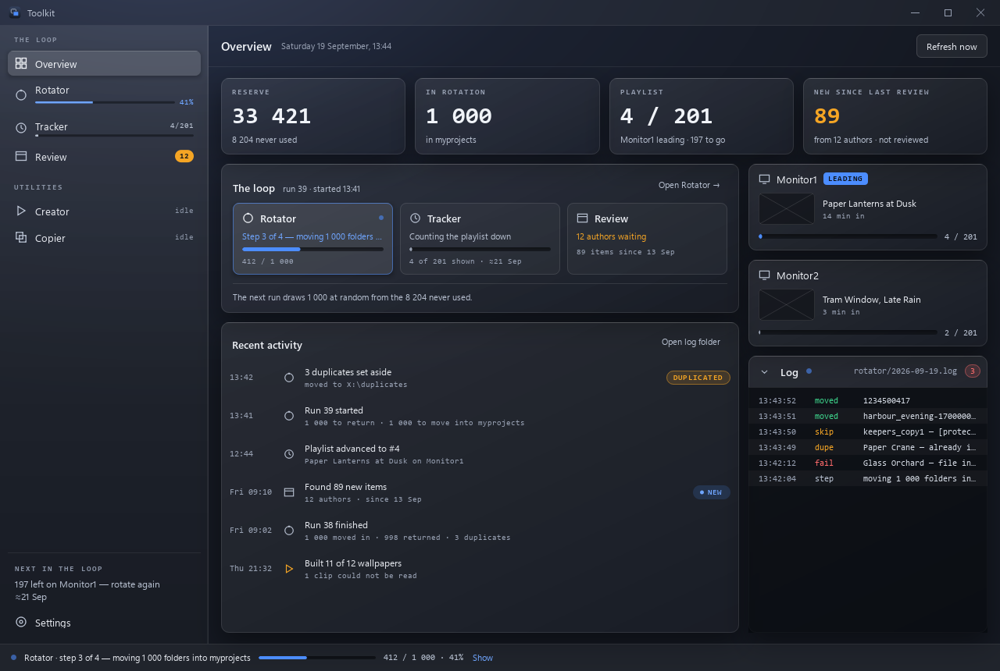

# Wallpaper Engine Toolkit — documentation

Five tools in one window, each solving a different part of the same problem:
keeping a large Wallpaper Engine library moving without doing it by hand.

Start with [Installing](installing.md), then [Getting started](getting-started.md)
for what the first run already knows.

## Getting around

The window is a fixed frame: a sidebar of pages on the left, the page's title
and its buttons across the top, and a status line along the bottom. The
sidebar lists the pages in the order of **the loop** — rotate, watch the
playlist run down, review what is new — then the two utilities, and Settings
at the foot. **Ctrl+1 … Ctrl+7** go to each in that order.

The sidebar is live: each page says what it is doing without being opened —
the Rotator's progress while it runs (`41%`) or `ready · run 39` when it is
not, the leading monitor's count (`4/201`), `idle` or `working` — and under it
**Next in the loop** says what comes next (`197 left on Monitor1 — rotate
again ≈21 Sep`). The status line says what is running from any page, with
**Show** to go to it, and how the last job ended — cleanly in green, with
problems in amber — until you have looked at its page. Below 1 200 px wide the
sidebar folds into a rail of icons; their names are in the tool tips.

By keyboard: **Tab** goes down the sidebar, then the page's buttons and the
page itself in reading order, then the status line; **Ctrl+F** jumps to the
page's filter (Tracker, Rotator, Review); **Enter** answers a question and
**Esc** cancels it — except one that deletes, where Enter cancels too. With
Windows' animation effects off, nothing in the window moves: spinners stand
still beside the word "working".

## The pages

| Page | What it is for | Reach for it when |
|---|---|---|
| [Overview](overview.md) | The loop at a glance: the reserve, what is in rotation, the playlist's count and what is new since the last review; what each tool is doing; recent activity; the monitors and the newest log lines. | You open the window. |
| [Rotator](rotator.md) | Moves folders between a reserve and `myprojects`, with duplicate and history handling, and rebuilds the playlist. | Your library is far larger than one playlist, and you cycle through it. |
| [Tracker](tracker.md) | Reports how far Wallpaper Engine has got through the active playlist. | You want to know when the playlist is finished, so the next rotation is due. |
| [Review](review.md) | Groups the week's new wallpapers by author, and says what each has published since you last looked. | You triage new wallpapers weekly and care who made them. |
| [Creator](creator.md) | Turns video clips into Wallpaper Engine projects, **no preview needed** — it renders one from the video. | You have a folder of clips and want them usable as wallpapers now. |
| [Copier](copier.md) | Duplicates existing wallpaper folders N times each. | A playlist needs a wallpaper weighted more heavily, or you want copies to edit independently. |
| [Settings](settings.md) | The folders, Wallpaper Engine's settings file, counting in the background, the Steam key, and the selfcheck. | Setting up, or when a folder moves. |

## Everything else

| Page | Covers |
|---|---|
| [Installing](installing.md) | The installer: what it does, your data through updates and uninstalls, coming from an earlier copy. |
| [Getting started](getting-started.md) | First run, running from source, what needs setting up before which page works. |
| [Configuration](configuration.md) | Every setting, every file written, where each one lives, and what to back up. |
| [Gallery](gallery.md) | The wall of previews the Review page opens: what the badges mean, and subscribing. |
| [Authors database](authors-database.md) | The file behind Review — what is in it, its backups, and restoring one. |
| [Building](building.md) | Producing a standalone `.exe`, and the installer. |
| [Development](development.md) | Architecture, the frame and its pages, the test suite, and the look and feel: tokens, type, icons, motion, the kit preview, snapshots. |
| [Troubleshooting](troubleshooting.md) | What each failure looks like and which file answers it. |

## What this does not do

One thing writes to Wallpaper Engine: a rotation rebuilding its playlist — see
[the Rotator](rotator.md#wallpaper-engines-playlist). The Tracker reads
`config.json` and the files in `bin/`; it never changes them. Rotation moves
*your* folders between *your* directories. The one action that reaches outside the machine is
subscribing to a workshop item, which is a deliberate click in the
[gallery](gallery.md#subscribing).
