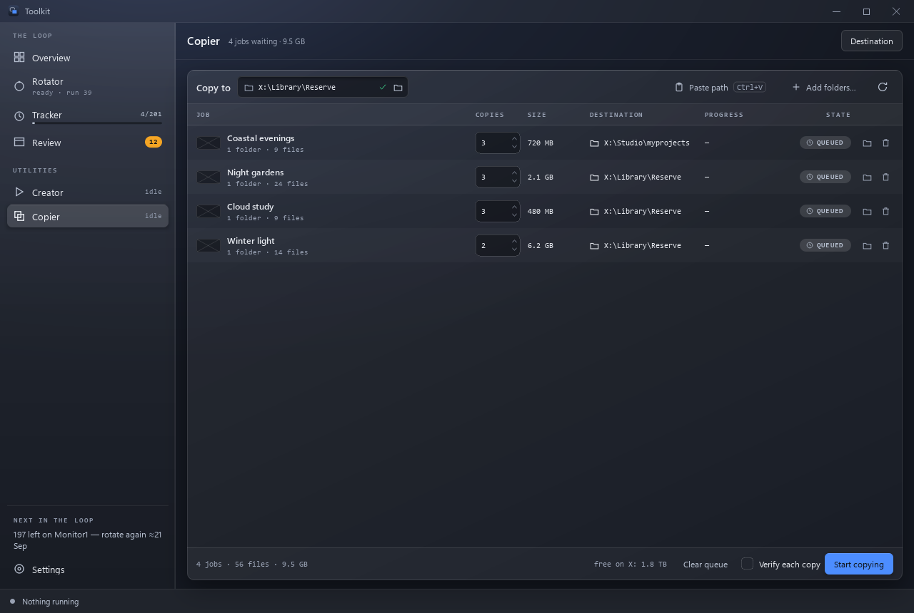

# Copier

**Duplicate wallpaper folders N times each, in a sequential queue.**

Wallpaper Engine playlists have no per-entry weight. If a wallpaper has three
copies in the playlist, it gets three entries instead of one. Selecting the
original as well adds another entry. Copies are independent folders and can
also be edited as separate projects.

## Prepare the queue

1. **Choose folders**, drop folders from Explorer, or use **Paste path**
   (**Ctrl+V** on the Copier page). The folder chooser supports Ctrl/Shift
   selection. A folder already in the queue is not added twice.
2. Set **Copies** for each job (default **3**). Double-click the cell or press
   **F2** to use the spin box. One means one numbered duplicate.
3. Set **Copy to** above the table, or open **Destination** in the page header
   to change it in Settings. A row's folder button overrides that job's
   destination; leave the override empty to follow the global destination.
4. Optionally turn on **Verify each copy**.
5. Review the jobs, expanded file/byte totals and free space, then press
   **Start copying** and confirm the destinations.

The trash button or **Delete** removes a queued row. **Clear queue** removes
waiting jobs. Neither action deletes source or destination files.

Folder sizes and free space are read in the background. Until a size is known,
the table shows an ellipsis. Jobs on the same filesystem share one free-space
budget even when they target different folders. A warning explains when the
queue does not fit. The engine checks available space again before copying
each job; a job that cannot fit fails, and the next one is still tried.

Paste accepts one path per line, optionally followed by a positive copy count:

    "X:\Sources\Coastal evenings" 3
    X:\Sources\Night gardens 5

Quotes around the complete path let a folder name end in a number. A blank
line is ignored; zero copies is rejected.

## While copying

Jobs run one at a time. **Pause** takes effect between files; the file already
being written finishes first. **Resume** continues. **Stop** interrupts large
files between chunks and removes the unfinished copy; fully completed copies
stay. If cleanup itself fails, the error names the partial folder that remains.

The header and each row show progress, with live bytes per second.
Time remaining is marked **≈** and is shown only when a live rate is available.
File counts include every file across every requested copy. The log expands
during a run. The sidebar, global status line, journal and off-page toast
report the same operation.

An unreadable source or write/verification error stops only its job. The
failure stays in the row and callout, and the queue continues.
**Retry** during a run appends the failed jobs after the waiting ones.
**Skip** dismisses them from the work still to do and preserves their reason
in the row tooltip. Folders sent from Tracker while a run is active wait for
the next explicit Start.

## Results and retry

The finished screen shows successful/failed jobs, bytes and files copied,
elapsed time and average speed. **Retry the failed job** returns unfinished
work to the queue for review and another explicit Start. Already completed
copies are remembered for this session and are not made again.

**Open destination** opens the selected row's destination, or the global
destination when no row is selected. **Clear finished** clears completed,
failed, stopped and skipped rows from the page; it never removes their files.
The queue and retry records are not restored after closing the app.

## Numbering and verification

Copies use the original folder name with `_copy1`, `_copy2`, and so on.
Numbering continues **after the highest existing suffix**, even if earlier
numbers are missing. Existing directories are never merged into or overwritten.
Subfolders, including empty ones, are preserved.

Verification compares relative file names, file count and each file's size,
and also detects source changes during the copy. It does not hash file content.
A truncated or missing file fails that copy; the newly created incomplete
folder is removed, and the job retains the reason.

A destination inside a source folder is rejected. Linked files, symbolic
links and junctions in a source are rejected rather than traversed.

## Folders from Tracker

**Send to Copier** on a Tracker row adds its folder for three copies while you
stay on Tracker. The toast's **Show** opens Copier. Repeated sends do not add a
second job. A folder renamed with `[protected]` is sent under its new name.
Nothing is copied until you start the queue.

Review's gallery retains **Subscribe selected** and **Subscribe page**; it
does not send items to Copier.

## Settings and storage

The default destination and verification choice are remembered in
`data/suite.json`, under `copier.dest` and `copier.verify`. Counts, destination
overrides and the queue belong to the current session.

Copies occupy real disk space: twenty copies of a 400 MB wallpaper need about
8 GB. Nothing rewrites `project.json`, so copies keep the original display
title until you edit them. A rotation treats these as ordinary folders;
use [protected folders](rotator.md#protected-folders) when copies must stay
in the current playlist.
