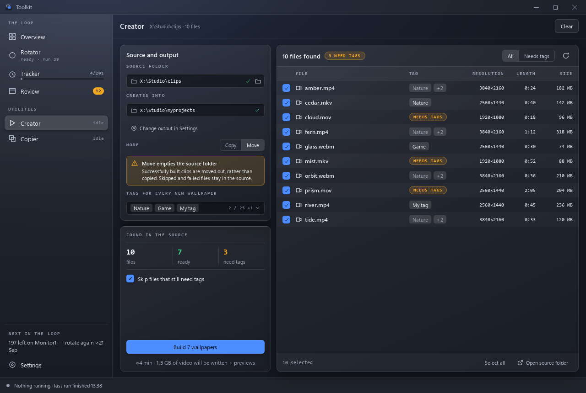

# Creator — wallpapers from your videos

Creator turns each selected video into a Wallpaper Engine project containing
the video, a generated preview and `project.json`.

Choose a **Source folder**, or drop it onto the empty page. Creator reads the
folder in the background and streams filenames, tags, dimensions, length and
size into the table. Reading writes nothing. **Stop reading** keeps the files
already checked. Unreadable and unsupported files show their reasons.

The **Creates into** folder comes from [Settings](settings.md). Supported
extensions are `mp4`, `webm`, `mkv`, `mov`, `avi` and `m4v`. If ffmpeg is missing,
the page explains how to restore it before reading again.

Choose **Copy** to preserve every source video, or **Move** to remove each source
after its completed wallpaper has been verified. Move remains the default;
its warning stays visible while configuring and building.

## Tags and selecting files

**Tags for every new wallpaper** offers Wallpaper Engine's 25 genre tags and
an **Other tag…** field for additional comma-separated tags. Nothing is tagged
automatically. Click a file's TAG cell to make a different choice for it:

| Choice | TAG cell | Result |
|---|---|---|
| Follow batch | Muted tag pills | Uses the batch tags, including later changes |
| Own tags | Normal tag pills | Uses this file's tags |
| None | NEEDS TAGS | Writes an empty tag list, even with a tagged batch |

An empty resolved tag list always displays **NEEDS TAGS**, including a file
following an empty batch. **Skip files that still need tags** is on by default.
Turning it off allows untagged wallpapers. The **Needs tags** filter helps find
files needing a decision.

Use row checkboxes to choose a subset. **Select all** toggles the visible usable
rows. The Build button follows the selected files and skip option. The size
below it is the exact video payload; preview and JSON sizes are extra. A time
estimate appears only after a measured successful build.

## Building safely

Press **Build N wallpapers** to review the destination, bytes and operations in
the confirmation. A Move confirmation explicitly names source removal.

Creator creates a folder named `<filename>-<unique suffix>` for each video.
Previews are square, **480×480 at 15 fps**, capturing **5 seconds from 1 second**
into the clip. Short clips start earlier. GIF generation uses a two-pass
palette; a failed GIF falls back to `preview.jpg`. A preview failure preserves
the input and removes the incomplete project.

For each wallpaper, Creator:

1. Generates its preview and copies the video.
2. Writes `project.json` with the selected tags.
3. Checks the video size, nonempty preview and JSON readback.
4. Removes the source only after verification, in Move mode.

**Pause** lets the current wallpaper finish, then waits between files. **Resume**
continues. **Stop** cancels subsequent work; an unfinished wallpaper is rolled
back with its source preserved. Completed wallpapers remain available.

The run panel shows the current operation, overall progress, verified bytes
written, created/skipped counts and any measured estimate. Per-item bars remain
indeterminate during work because ffmpeg does not supply a percentage here.
The console contains the current log file's tail; full logs are retained for
30 days in `data/logs/creator/`.

## When it finishes

The result shows created, skipped and failed counts. The completion list loads
the newly written preview GIF as a still, and shows each new folder id. Double
click a created wallpaper to open its folder, or use **Open folder** for the
output directory.

**What was left out** explains skipped tags, unsupported formats, damaged files
and build errors. **Add tags and build these** returns the remaining source files
to the table. Correct their per-file tags or batch choices, then confirm that
subset build. Existing successes are not rebuilt.

**Rebuild playlist** appears only when the output matches the Rotator's
destination. It opens the Rotator's existing standalone rebuild confirmation;
Wallpaper Engine restarts once. Otherwise manage the exported wallpapers in
Wallpaper Engine yourself. **Start another folder** clears this scan.

Work continues while another page is open. JobCenter supplies the global status,
the journal records each result, and an off-page completion shows a notification
with a **Show** link.

Source, output, mode and batch tags remain in `data/suite.json` under `creator`.
Per-file choices belong to this scan; a fresh scan starts each file following
the batch. Existing `autocreator` settings still migrate to `creator`.
