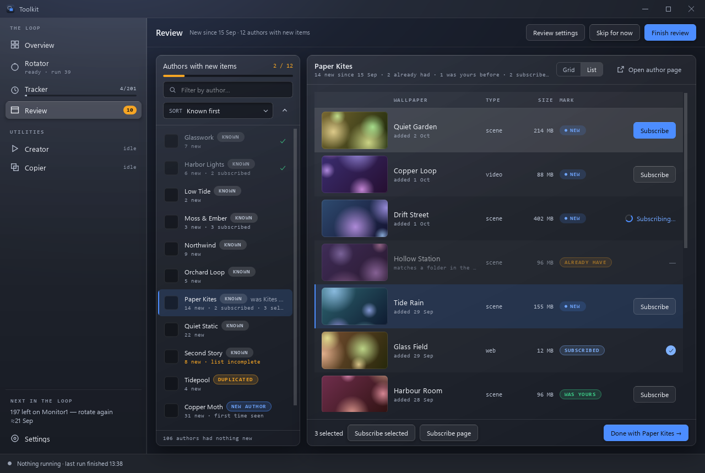

# Gallery

**An author's new wallpapers, on the [Review](review.md) page: a grid of
cards, or a list.**

## What it is for

Everything one author has published since your last visit that you are not
subscribed to, newest first, as previews. It is where the decision actually
gets made: you are looking at pictures, not at a list of titles.

Over it: the author's name and what is new — *14 new since 13 Sep · 2 already
had · 1 was yours before · 3 subscribed · 87 published in all* — **Grid /
List**, and **Open author page** (their workshop page in the browser).

## A card

- **The preview**, 16:9 and cropped to fill the card. Workshop previews are
  mostly square, so a card shows the middle of one: its top and bottom fifth
  are left out. Animated previews play (see below).
- **One mark**, top left, on the picture — see the table.
- **What it is and what it weighs**, bottom left on the picture:
  *scene · 214 MB*. A download of a gigabyte or more says its size in amber.
- **The title**, and under it when it was published (*added 18 Sep*) — or, for
  one you already have, where: *matches a folder in the reserve*.
- **The edge** takes the mark's colour: blue for new, amber for already have,
  green for was yours.

| Mark | Meaning |
|---|---|
| **New** | Published since your last visit, and this machine has never had it. |
| **Already have** | A copy is kept in the Rotator's folders — the reserve, myprojects or the duplicates folder — named by its workshop id. The card is set back, and says where. |
| **Was yours** | Subscribed once and dropped: Wallpaper Engine's folders still remember it, and no copy is kept. |
| **Queued** | It is in the Wallpaper Engine folder being reviewed. |
| **Subscribed** | Taken — now, or earlier in this review. The card is set back, with a check. |

Until the scan has asked whether this machine had a wallpaper before, a card
claims neither: **"new" used to be painted from "published since your last
visit"**, which is true of every card in the gallery, so a wallpaper downloaded
and deleted twice still called itself new. The scan asks once, at its end, for
every author with something new.

**Subscribed and already-had cards are set back where they stand**, never
removed: a card disappearing under the cursor loses your place in a wall of
four hundred. Leave the author and come back, and the ones subscribed during
the review are still there, set back.

### "Already have" and "was yours"

Two records answer "did you have this", and the card now says which one did:

| Record | What it knows | Mark |
|---|---|---|
| `project.json` in the Rotator's folders (`data/library.json` caches the walk) | every workshop wallpaper you kept a copy of, and in which folder | **Already have** |
| Wallpaper Engine's own folders (`config.json`) | every id ever put in one, for ever | **Was yours** (when no copy is kept) |

Before 3.7.0 both were one mark, *was yours*. The finished review counts them
apart: *already had* and *were yours*.

## Under the pointer, and while subscribing

- **Click to subscribe**: the card under the pointer darkens and says so, with
  a blue edge and halo. A card that is subscribed or already had offers
  nothing (the right button still opens it in Steam).
- **Subscribing…** with a turning ring on the one card Steam is being asked
  about; **Waiting…** on cards queued behind it.
- The right button opens the wallpaper's page in Steam.

## Grid or list

**Grid** is 3 to 5 cards across, as many cards of about 230 px as the window
holds (three at 1 280 px wide, five at 2 560).

**List** is a table of the same page: the preview, **WALLPAPER** (title and
date or where), **TYPE**, **SIZE**, **MARK** and a **Subscribe** button, which
turns blue on the row under the pointer. A row being subscribed says
*Subscribing…*, one you already have a dash, one subscribed a check. The list
sorts by any column but the preview.

The choice is remembered (`review.view` in `suite.json`).

## Choosing several

- **Ctrl-click** a card, or click the **check** that appears top right on the
  card under the pointer, to select it; **Shift-click** selects everything
  from the last card chosen up to this one. In the list, a click anywhere on a
  row but its button selects it.
- **Ctrl+A** selects every card on the page that can be subscribed to;
  **Esc** lets go of the selection.
- The selection spans pages, and the author's row on the left says how many
  are selected: *14 new · 3 selected*.

A plain click on a card still subscribes, as the card says, whatever is
selected.

## The bar

Under the gallery:

- **3 selected**, and **Subscribe selected** — in the order you chose them.
- **Subscribe page** — every card on this page not taken yet.
- The pages: thirty wallpapers to a page; the numbers show from two pages.
- **Done with <author> →** — the author is ticked on the left, the count
  (*3 / 12*) moves on, and the next author waiting opens. Nothing is written
  until **Finish review**.

Both Subscribe buttons need **Steam directly** in Review settings: with
**Steam's page**, they would open a browser window per wallpaper.

## The review as a list

When the review is finished, **Open review as a list** shows every author's
wallpapers in one list, under their names (*GLASSWORK 7 new*), with the same
marks and buttons — to look back over the week, or subscribe to something
after all. Clicking an author on the left goes to their part of the list.
**Back to the summary** returns to the finished review.

## Subscribing

Wallpaper Engine's own Subscribe button is not a web request. Taking its install
apart: `bin/steam_api64.dll` is Valve's Steamworks redistributable and exports
`SteamAPI_ISteamUGC_SubscribeItem`; `wallpaperui.exe` — the browser, not the
renderer — loads it and asks for `STEAMUGC_INTERFACE_VERSION020`. A subscription
is a local call into the running Steam client, which performs it for whoever is
signed in.

So the page offers two routes, chosen under **Subscribe by** in
[Review settings](review.md#how-a-click-subscribes):

- **Steam directly** — the same call, from this window. One click and the
  wallpaper is on its way. The process declares app id 431960 while the API is
  open, so it is opened for one action and closed again.

  Valve does not sanction using an app id you do not own. This is not a
  licensing or safety problem — the account, the machine and the copy of
  Wallpaper Engine are all yours, and workshop items are free — but it is
  **unsupported**, and a Steam update could close it.

- **Steam's page** — `steam://url/CommunityFilePage/<id>`, where
  Subscribe is one click. Nothing unsupported, one more click.

Subscriptions go through one queue and one Steam connection, in the order
asked: a card says **Waiting…** until its turn and **Subscribing…** during it.

Either way the page watches the workshop folder and marks a wallpaper as taken
when it arrives, so subscribing in Wallpaper Engine itself is noticed too.

Steam must be running for either route.

## How it works

### Previews

Fetched on a thread pool, cached in `data/thumbs`, and drawn into a virtualised
grid — 1 200 cards is a `QListView` with uniform item sizes, not 1 200 widgets.
A still is kept no larger than 640 px and cropped to each card's size once.

Nearly half are **animated**: Steam serves an animated wallpaper's preview as a
real GIF, so `QMovie` plays it.

Their still frame is deliberately not frame zero. These previews commonly fade
in from black, and a quarter of them were still pure black twelve frames in — so
frames are read until one is bright enough to be a picture, on the worker thread
rather than in front of the window.

### It animates, but not thirty at once

Steam's own browser animates its whole grid and so does Wallpaper Engine, so a
wall that only moves under the cursor reads as broken.

Building a decoder for all thirty cards of a page does not work, though, and the
way it failed was the worst kind. The previews arrive in bursts of six from the
download threads; each arrival was handled on the GUI thread by sweeping the
whole page and starting a player on the spot; and on one author's gallery the
window simply stopped answering — no previews, no repaints, nothing. Short of
that it was merely bad: twenty-one players came to 178 frames a second, each
frame scaled and each asking for its row to be repainted, leaving the GUI thread
334 ms behind.

Three things fixed it:

- An arrival now only **notes** that the players are worth reconciling, and a
  timer does that once per burst rather than once per preview.
- At most **eight** animate at a time — the ones nearest the top of the view,
  where the eye is. The rest keep their still frame.
- Frames are collected and repainted on one **50 ms clock**, so repainting costs
  what the page costs rather than the sum of every player's frame rate.

The same gallery that froze now opens and stays open, with the GUI thread never
more than **76 ms** behind.

### And never at the window's expense

That was not the end of it. On 18 September the window froze again, while it
counted what each author had published, a few authors into clicking through the
results — and
the cause turned out to be one level down, in how Python and Qt share a process.

PySide gives up Python's global lock (the GIL) around every call into Qt and
takes it back afterwards. Taking it back is free while nothing else wants it.
While another thread is busy in Python — parsing a page of Steam's answer,
building an author's item list — it is a wait of up to the interpreter's switch
interval, 5 ms by default, *per call*. A repaint makes hundreds of calls. And the
animation made a few hundred more every second: each frame of each player was
scaled and turned into a pixmap in Python, eight players at 25 frames a second.

Measured on one real page of thirty GIF previews, eight of them playing, with
threads busy in Python beside it:

| | busy threads | timer ticks out of 400 | worst delay |
|---|---|---|---|
| before, 5 ms switch interval | 1 | 2 | 4.1 s |
| before, 5 ms switch interval | 2 | **0** | the window never answered |
| now, 5 ms switch interval | 1 | 257 | 0.4 s, and the animation rested |
| now, 0.5 ms switch interval | 1 | 399 | 4 ms |
| now, 0.5 ms switch interval | 4 | 398 | 23 ms |

What changed:

- **No Python runs per frame.** `QMovie` is given the size that just covers
  the card and scales its own frames; the delegate paints the movie's current
  frame; and one 50 ms clock repaints only the previews whose frame number
  moved on.
- **The animation rests when the window is behind.** The same clock notices
  when it runs late — twice running by more than a quarter of a second — pauses
  every player, and resumes them after two seconds on time. Whatever else is
  holding the window up, the animation is never what tips it over.
- **The switch interval is 0.5 ms**, set once at start-up, so a busy thread
  hands the GIL back ten times sooner.
- **Only the page on screen is kept in memory.** Every preview of every page
  ever shown used to stay: 662 previews and 945 MB after clicking through ninety
  authors. Now that is 150–200 MB, flat. The bytes are in `data/thumbs`, and a
  page revisited is read back from disk.
- **Turning the page drops the downloads queued for the last one**, instead of
  making the page on screen wait behind them.

### Nothing decodes from a QBuffer made in Python

On 4 October the window froze for good when the list was switched back to the
grid while an author's previews were landing. The stacks (taken with `gdb` on a
reproduction) showed a lock-order deadlock between Python's GIL and a lock Qt
holds while it works out an image's format:

- a download worker was decoding Steam's bytes from a `QBuffer` created in
  Python. Qt held its image lock and read the buffer, and reading a device made
  in Python asks Python whether its methods were overridden, which takes the
  GIL;
- the GUI thread was in `QMovie.start()` for a grid player. PySide keeps the
  GIL through that call (measured: `QImageReader.read()` gives it up,
  `QMovie.start()` and `QImageReader.size()` do not), and it was waiting for
  the image lock.

Each waited for the other, at 0 % CPU. A player looping on a Python `QBuffer`
deadlocks the same way against a worker in `QImageReader.size()`: eight looping
players and two such workers froze within seconds, while the same players
reading files ran clean.

So no decoder reads a Python-made device, on any thread:

- the worker decodes the still from the file the download is kept in,
  `data/thumbs/<id>.img`;
- a grid player plays that same file;
- a table's player (the Tracker's, the Rotator's, the Copier's, the
  Creator's) plays a copy of the folder's `preview.gif` under
  `data/thumbs/local/anim/`. It plays a copy, not the preview itself, because
  an open `preview.gif` would keep its folder from the Recycle Bin. Copies stay within 256 MB, and the least recently
  played go first.

The reproduction with thirteen 4.8 MB GIF previews froze on the first page
before; now 24 rounds of grid → list → grid at 0, 30 and 100 ms leave the GUI
thread at most 0.12 s behind.

### A card is a few copies

The redesign (3.7.0) put more cards on screen — three to five across instead of
one 416 px card — so all eight players are visible at once and every frame
repaints eight cards. While another thread is busy in Python each call into Qt
can wait for the GIL, so what a card costs is how many calls it makes:

- What a card shows is drawn once into pixmaps and copied after: the preview
  cropped to 16:9 with its corners, edge, chip, plate and check (one copy for a
  still card), the title and its line (another).
- A playing card is its frame through a rounded clip, then one copy of
  everything over it.
- The view repaints every card inside the bounding box of what changed; a card
  the changed region itself misses is skipped before it costs anything.
- The spinner on the card being subscribed to turns on the shared clock, which
  repaints the spinner's few pixels, not the card.

Measured with `tests/perf_gallery.py`: thirty made-up animated previews, eight
playing, two threads busy in Python, the 0.5 ms switch interval, offscreen. A
frame is one repaint of the gallery.

| | gallery size | frame time p50 / p95 | 50 ms clock ticks (of 400) |
|---|---|---|---|
| before 3.7.0 (one column) | 690 × 640 (a 1 280 px window) | 17.7 / 22.3 ms | 320 |
| 3.7.0 (three columns) | 690 × 640 | **11.2 / 14.1 ms** | 320 |
| before 3.7.0 (four columns) | 1 970 × 1 200 (2 560 px) | 70.5 / 82.6 ms | 241 |
| 3.7.0 (five columns) | 1 970 × 1 200 | **12.2 / 15.2 ms** | 319 |

With no thread busy, the same frame takes 2.4 ms: the rest is waiting for the
GIL, which is why the number of calls is what was cut.

If the window ever stops answering anyway, it leaves the stacks of every thread
in `data/window-hangs.log` — see [Troubleshooting](troubleshooting.md#the-window-stopped-answering).
