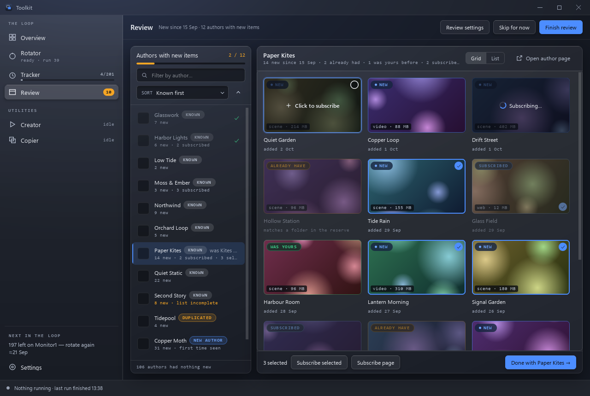

# Review

**The week's new wallpapers, grouped by who made them.**

## What it is for

Every day some wallpapers get put into Wallpaper Engine's **`new`** folder. At
the end of the week they need going through — and the thing worth going through
is not the wallpapers but their **authors**. Someone who made one wallpaper you
liked has probably made others.

By hand that means: click each wallpaper, note who made it, search a database of
39 000 authors, create them or read off when you last visited, open their
workshop, find the first wallpaper published after that date, and browse
forward. Measured on one real week: 39 wallpapers, **26 distinct authors**,
seven of whom had never been added.

This page is that, done for you, as one flow: **scan → go through the authors →
finish**.

## When to reach for it

- Weekly, on whatever you have put in the `new` folder.
- When you want to know which authors are worth following.
- When you want to catch up on one author's back catalogue without scrolling
  past what you already have.
- When you want to go through more than one folder, or the whole library at
  once. See [What gets reviewed](#what-gets-reviewed).

## What you need first

Nothing. Press **Scan for new items**.

- The **authors database** is a file, `data/authors.sqlite`, made the first
  time the page needs it and backed up after every change. See
  [Authors database](authors-database.md).
- A **Steam Web API key** is optional, and worth having. Without one the page
  works, with less — see [what the key is for](#what-a-steam-web-api-key-is-for).
  It is free from
  [steamcommunity.com/dev/apikey](https://steamcommunity.com/dev/apikey) and
  goes in **Review settings** (the button in the page's header, or
  **Review settings…** on the [Settings page](settings.md)), which has **Show**,
  a **Test** button and keeps the key encrypted for this Windows account.

## How to use it

1. Put wallpapers in Wallpaper Engine's `new` folder during the week.
2. Open the page and press **Scan for new items**. The page says what it is
   doing as it does it: how many authors it has checked of how many, the time
   left once it has a rate to go by, the author it is on — and, on the right,
   **Found so far**: every author with something new, as they are found.
   **Cancel scan** stops it at the next author.
3. When the scan finishes, the authors with new items are listed on the left
   and the first is opened: everything of theirs you are not subscribed to and
   have not seen since your last visit, newest first, as
   [a gallery](gallery.md) — a grid of cards or a list. Click a card to
   subscribe; Ctrl-click or its check selects several, for **Subscribe
   selected**.
4. Press **Done with <author> →**. The author is ticked, the next one opens,
   and the count at the top of the list moves on: **3 / 12**.
5. Press **Finish review** in the header. The page lists what it will write
   first — *3 authors to create, 21 visit dates to move, 2 names to bring up to
   date*, and the changes themselves — and writes it only when you say so: in
   one go, all of it or none, backed up straight after. The page then says how
   the review went.

**Skip for now** leaves the page without writing anything. The review is still
there when you come back — until the toolkit is closed: galleries are not kept
from one start to the next, so a review left unfinished then needs a new scan.

### The page, state by state

| State | What it shows |
|---|---|
| **Nothing scanned** | what a scan does, **Scan for new items**, and the last scan: *last scan Fri 09:10 · 12 authors had new items* |
| **Scanning** | the scan as it goes, *34 / 118 authors checked · ≈1 min left*, the author being checked, **Found so far** |
| **Stopped** | why, in plain words, with the last lines of its log; **Carry on from author 34**, **Start over**, **Open log folder** |
| **Reviewing** | the authors with new items on the left, ticked as you go; an author's gallery on the right; **Skip for now** and **Finish review** |
| **Finished** | how many authors went through, what was subscribed, the numbers (new items found, subscribed, already had, were yours), the last scan, **Open review as a list** and **Reopen review** |

The sidebar's Review item says the same in a word: a bar while it scans, a
badge with the authors still waiting, *stopped*, or *finished*.

### When a scan stops

A scan stops on **Steam**, not on an author. One author Steam has no answer for
(a private profile, a 404) is that author's problem: it is counted, said under
the list (*2 could not be read*) and the scan goes on. Steam not answering at
all — every attempt timing out, a server error, being told to slow down — would
fail every author left the same way, one slow timeout each, so the scan stops
there instead, and so does a key Steam refuses, or an authors database that
will not open.

Nothing was changed when it stops, and what was counted is kept. **Carry on
from author 34** counts the authors it had not reached — the first one not
counted and every one after it — and asks nobody a second time. **Start over**
scans from the beginning.

### What gets reviewed

**Review source** in Review settings holds Wallpaper Engine's own folders, read
out of its `config.json` each time the dialog opens (with how many wallpapers
each holds), so a folder you made this morning is in the list this afternoon.
Under them are three that cross folders:

| Choice | What it reviews |
|---|---|
| a folder by name | what that folder holds — `new`, the weekly habit |
| **All folders** | everything in any of them, each wallpaper once |
| **Not in any folder** | what you have that was never filed anywhere |
| **Everything you have** | both together — the whole library |

The last two exist because a folder is not the library. On the machine this
was built against the three folders remember 16 629 ids between them; a
wallpaper subscribed to last night and not yet filed is in none of them, and
before this it could not be reached at all.

Whatever you choose, only wallpapers Wallpaper Engine can actually show are
reviewed — see [below](#what-is-in-the-folder-is-not-what-the-folder-remembers).

### How a click subscribes

**Subscribe by** in Review settings: **Steam directly** subscribes from this
window, **Steam's page** opens the wallpaper in Steam to press Subscribe there.
See [Subscribing](gallery.md#subscribing) for why both exist.

### What is in the folder is not what the folder remembers

Unsubscribing from a wallpaper does not take it out of a folder — its id stays
in `config.json` for ever. A folder used as a queue for years accumulates
entries with nothing behind them. On one real folder: **2 155 ids remembered,
39 still on disk**.

Wallpaper Engine shows the 39, because those are the ones it has files for, and
so does this page. Reading the folder literally would mean re-reviewing every
wallpaper ever put aside and since deleted, turning a week's 26 authors into 453.

### Whether you have had a wallpaper before

A card in a gallery says **already have** when a copy is kept in the Rotator's
folders, **was yours** when it was subscribed once and dropped, and **new** when
this machine has never had it. Two records answer that, and one of them used to
be missing:

| Record | What it knows | Ids here | Mark |
|---|---|---|---|
| `project.json` in the local libraries | every workshop wallpaper you kept a copy of, and in which folder | 4 412 | already have |
| Wallpaper Engine's own folders | every id ever put in one, for ever | 16 629 | was yours |

The second is the larger by far. A wallpaper subscribed to and later dropped
without ever being copied leaves nothing in the libraries — but its id stays in
the folder. **14 915** ids on this machine are in that state, and only 425 of
them were in the copies index, so before this they came back around looking as
though they had never been seen.

The answer costs a parse of a 2.35 MB `config.json` — 0.02 s — so it is worked
out once, at the end of the scan, for every author with something new; after
that it is a lookup per wallpaper. That is also what makes the finished
review's *already had* and *were yours* whole counts rather than ones for the
galleries you happened to open.

### Finishing: the visit date moves to the newest wallpaper the review covered

Not to "now". An author who publishes something while the window is open would
otherwise be skipped for good, and the entire purpose of the date is that
nothing is skipped.

**Finish review** writes, for every author the scan counted:

- a new author: created, with the visit date;
- a known one: the visit date moved, and the name Steam uses now when the
  database still has an older one.

An author nobody opened still gets their current name; an author with nothing
new is still created, so next week knows them. What *Done with* marks is how
far you have gone through the list — it is kept in `review_last.json`, not
written to the database.

The confirmation lists every change (the first 14, then *… and N more*). The
result is said when it is written — *3 created, 23 updated. Backup:
authors-20260930-141200-38901.json.gz* — in the status line and the activity
journal too.

## How it works

### One flow, two costs

**Naming the authors takes seconds.** The wallpapers are described in batches of
200, a hundred profiles come back per request, and the authors database is a
local file — 616 authors looked up by both of their keys in 11 ms.

**Counting what each has published since is a request apiece**, and the scan
does it straight after, author by author, saying each as it starts and ends
(`engines/review_flow.ScanFlow`). The requests go out through the Steam
client's own pool rather than one after another — measured at **17.9 s for the
85 authors** of an ordinary week. The workshop folder is read once for the
whole count instead of once per author.

### What a Steam Web API key is for

Without a key the toolkit sees Steam the way a signed-out visitor does. The
obvious way to list an author's work is their public workshop page, and it is a
trap. Measured against one real library, a signed-out listing does not show an
author's work — it shows a fraction of it:

| author | public listing | owned here | of those, unlisted |
|---|---|---|---|
| A | **0** | 174 | 174 |
| B | 191 | 58 | 24 |
| C | 278 | 49 | 47 |

Mature and questionable content is invisible to a signed-out client, and it was
**43%** of that library. The Web API has no such gate, so with a key everything
is read through it and the lists are whole.

The key is still optional, because the page is useful without it — but going
without is said, not discovered:

- A **banner** on the page, before a scan, says what is missing, with
  **Add a key…** next to it. **Hide** puts it away; the two warnings below stay.
- An author counted without a key says so under their name: *list incomplete*,
  and over their gallery: *read without a Steam key, mature wallpapers left out*.
- **Finish review** warns, and makes **Cancel** the default, when a visit date
  would be written from such a list. That is the one consequence adding a key
  later does not undo: the date moves past the mature wallpapers that were left
  out, and they are not offered again.

Names are the other difference. With a key a hundred profiles are one request,
so every scan fetches them fresh. Without one each is a page of its own, 0.4 s
apart — three minutes for an ordinary week — so a keyless scan takes names from
the cache, which is at most two weeks old, and fetches only the ones it lacks.

A key Steam refuses stops the scan with a sentence saying so, rather than
quietly counting less. **Test** in Review settings asks Steam with the key
before you save it.

### Where the time goes, measured rather than guessed

Identifying the authors is under two seconds for a folder of 80 wallpapers,
and opening the authors database is 5 ms of it.

Counting what each has published since is the phase with the waiting in it, and
it is latency and nothing else: one request per author, 641 ms median, all of it
the round trip. Done one author at a time that was **44.2 s for fifty authors**
with the machine idle throughout. They go through the Steam client's own pool
instead, where the per-host throttle still paces the requests — so Steam is
asked no harder, the waiting simply overlaps:

| workers | time for 52 requests |
|---|---|
| 1 | 44.2 s |
| 4 | 16.4 s |
| **8** | **11.3 s** |
| 12 | 11.1 s |

Eight is where the gain stops, and that is the default. At that point the
throttle is the whole of what is left (52 requests x 0.2 s = 10.4 s).

`IPublishedFileService/GetUserFiles` returns items ordered by `time_updated`,
newest first — measured, not documented, and re-checked by the test script — and
an item is never updated before it was created. So paging can stop at the first
page whose contents were all last touched before the visit date: for an author
with 1 204 wallpapers, one request instead of thirteen.

The page's empty state says how long the last scan took, from the scan itself;
it never promises a time it has not measured.

## Files

| File | What it holds |
|---|---|
| `data/authors.sqlite` | the authors database: one row per author, with the visit date |
| `data/review_last.json` | the last scan: when, what it read, the authors with new items and which are done, what was subscribed, when the review was finished. Overview and the sidebar's badge read it |
| `data/secrets.json` | the Steam API key, DPAPI-encrypted |
| `data/library.json` | workshop ids found in the local libraries, so the four-minute walk is paid once |
| Wallpaper Engine's `config.json` | read, never written: its folders are both the review queue and the record of what you have had |
| `data/thumbs/` | preview images |
| `data/steam_cache.sqlite` | what Steam has already been asked |
| `data/authors_backup/` | a snapshot after every change, and `journal.jsonl` of every change — see [Backups](authors-database.md#backups) |
| `data/logs/review/` | each scan's and each write's log, kept for 30 days |

## See also

- [Gallery](gallery.md) — the wall of previews, what each badge means, and
  subscribing.
- [Authors database](authors-database.md) — the file, its backups, and
  restoring one.
