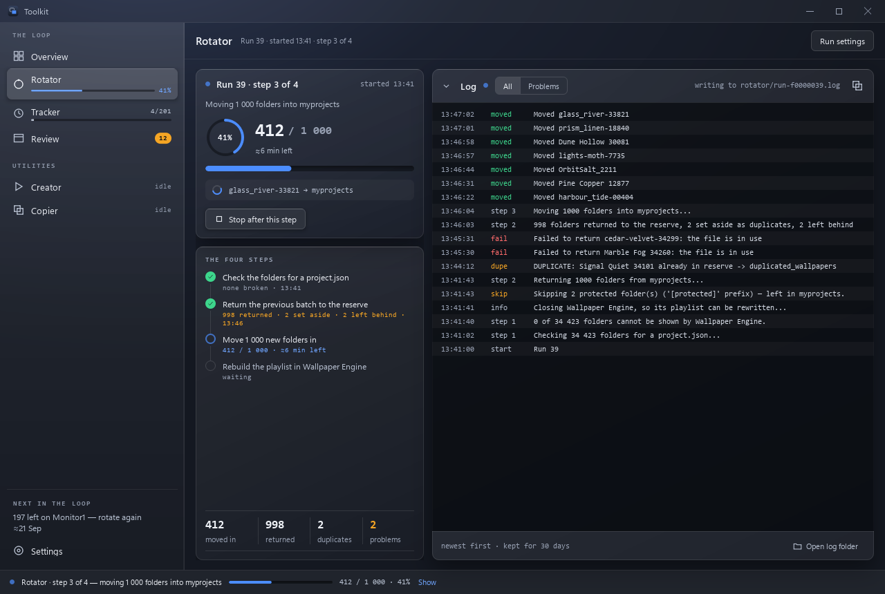

# Rotator

**Moves wallpaper folders between a reserve and `myprojects`, both ways.**

## What it is for

Wallpaper Engine shows what is in `myprojects`. A library of thirty thousand
wallpapers cannot be in `myprojects` — the browser becomes unusable and a
playlist built from it is meaningless.

So the library lives in a **reserve** folder, and a rotation carries a slice of
it into `myprojects`, builds a playlist from that slice, and later carries it
back to make room for the next one. The Rotator is that movement, with the
bookkeeping that makes it repeatable: what went where, what came back, what was
a duplicate, and what should never move at all.

## When to reach for it

- Your library is much larger than one playlist.
- You want a fresh set of wallpapers periodically without choosing them.
- You have just been told by the [Tracker](tracker.md) that the current playlist
  has been shown end to end.

## How to use it

1. On the [Settings](settings.md#folders) page, once:
   - **Reserve** — the library. Starts empty; pick it once.
   - **myprojects** — Wallpaper Engine's projects folder. Pre-filled from Steam.
   - **Duplicates** — where folders that turn out to be duplicates are moved.
     Starts empty.
   - **Folders per run** — how many folders to bring across. Default 1000.
2. On the Rotator page, **Next run** shows the reserve and `myprojects`, each
   with a ✓ once it has been found, the **batch** (the same setting as Folders
   per run, changeable here too), how the batch is drawn, and **Rebuild the
   playlist in Wallpaper Engine** — on by default; see
   [below](#wallpaper-engines-playlist).
3. **Start rotation.** The folders are checked first, and anything broken is
   put to you ([the reserve check](#the-reserve-check)); then **Start run N?**
   says exactly what will move, and which playlist will be rebuilt, before
   anything does.

All three folders are needed, as full paths — `D:\Wallpapers\reserve`, not
`reserve`. One left empty or relative counts as **not set**: Next run says
which, with **Set it in Settings**, Start rotation stays off, the table says the
folder is not set rather than showing an empty one, and neither a rotation nor
the Duplicates dialog acts on it. An empty path would otherwise mean the folder
the app was started from, which for the built exe is the install folder — the
program itself, and before 3.0.0 your `data\` too.

The first time, build a playlist in Wallpaper Engine from what is in
`myprojects`. From then on every rotation rebuilds it and starts it over by
itself, and the [Tracker](tracker.md) tells you when it is done.

## The page

The left column is the run; the right, one table with three views.

**Before a run** the left column is **Next run** — the folders, the batch, the
draw and the playlist switch — and **What a run does**: the run's steps, each
with what it will do this time, counted from the folders as they are now
(*1 000 folders go back · 3 duplicates set aside*, *1 000 drawn from 8 204 never
used*). *Drawn at random from 8 204 never used* is how every run draws; when
fewer than a batch are left it says so in warn, *Only 640 unused left — history
resets and all folders are eligible*. `[protected]` folders are a fact under
it, with a lock, never an option. Under **Start rotation**, *Takes about 15
min* once there are runs like it to go by (see
[below](#what-a-run-leaves-behind)), and nothing until then.

**While a run goes** the left column is the run — *Run 39 · step 3 of 4*, what
it is doing, the ring and the count, *≈6 min left* once the rate is measured,
the folder it last moved — and its steps, each with what it did and when it
ended, with the counts under them. The table gives way to the run's **log**,
line by line, All or just the Problems.

**When it has ended** the left column says how: *Run 39 finished cleanly*, *…
with 2 problems*, *… was stopped after the return*, or *… failed*, in that
colour, with what moved and what did not, the steps with their times, and the
way on:

- **Retry the 2 failures** — see [Retrying](#how-a-run-goes).
- **Open log** — the run's log, read back.
- **Rebuild playlist now** — when the playlist was not rebuilt, with a note
  that Wallpaper Engine is still playing the old one.
- **Next run** — back to setting up the next one.

After a clean run with the playlist rebuilt, it says the Tracker is counting
again and when it will be time to rotate (≈, an estimate from the Tracker's
own pace). The table shows the history, the run just finished marked.

**The table.**

- **Reserve** and **Current** (what is in `myprojects` now): each folder with
  its preview, author, type, size and when a run last moved it in; **New** on
  the ones never used since the history last started over — what the next run
  draws from — and **Unidentified** on one with no readable `project.json`.
  `[protected]` folders are marked with a lock. Rows appear as soon as the
  folders are listed; titles, authors and sizes fill in as they are read, the
  visible rows first. The summary above counts the folders, the never-used
  ones, and the size once every folder has been measured. **Check folders**
  runs [the reserve check](#the-reserve-check) on its own; **Open folder**
  opens it in Explorer.
- **History**: a row per run — when it started, how long it took, what it
  moved in, returned and set aside, and how it ended (*clean*, *2 problems*,
  *stopped*, *failed*). **Log** opens that run's log; for a run from before
  3.4.1, which kept none, it shows what the history recorded of it instead —
  the folders it moved in, set aside and could not move. **Export as CSV**
  saves the rows.

The header's **Run history** goes to the History view; **Duplicates · N**
opens [the duplicates](#duplicates) when there are any; **Run settings**, while
a run goes or after one with problems, goes to the Settings page (read-only
while the run goes).

The sidebar's Rotator item says what the page would: the bar and percentage
while a run goes, *ready · run 39*, *clean · run 39* after a clean one, *2
problems* in warn. A run that ends while you are on another page says so in a
toast there, with **Show**.

**Where the numbers come from.** The reserve and `myprojects` live on a hard
disk and hold tens of thousands of folders, so nothing about them is read on
the window's own thread: the counts are worked out on a thread, and the tables'
titles, types, previews and sizes come from a cache,
`data/library_meta.json`, which a thread keeps up to date — only folders new or
changed since are read again, and sizes are measured, visible rows first, while
the page is open. Leaving the page stops it; the next visit carries on.

## How a run goes

In this order, which is the order the page and the log show:

1. **Check the folders** for a `project.json` — [the reserve check](#the-reserve-check).
   Anything it finds waits for your answer before the rest begins.
2. **Return the previous batch to the reserve.** Wallpaper Engine is closed
   first, when the playlist is to be rebuilt. Every folder in `myprojects` goes
   back, except the `[protected]` ones; a folder whose name the reserve already
   has goes to the duplicates folder instead — duplicates are set aside here,
   not after the move.
3. **Draw and move the new batch in**, at random from the folders never used
   since the history last started over.
4. **Rebuild the playlist in Wallpaper Engine** and start it again — only with
   the switch on.

Each step's first and last lines in the log are numbered — `step 2`, *998
folders returned to the reserve, 2 left behind* — and each folder gets one
line: `returned`, `dupe`, `moved`, or `fail` with the reason.

**Stopping.** **Stop after this step** lets the step under way finish — every
folder of the return goes back, or every one of the batch comes in — and stops
there, with Wallpaper Engine started again on the playlist as it was. Stopped
after the return, nothing new is drawn; stopped after the move, the batch is in
and **Rebuild playlist now** brings the playlist up to date. It cannot stop the
playlist step, which is over in seconds. During the check it stops at once: the
check only reads. A stopped run is in the history like any run, as *stopped*,
so nothing it moved is drawn again by mistake; one stopped before it moved
anything is not recorded. There is no Pause: Wallpaper Engine is closed while a
run moves folders, and a pause would keep it closed.

**Retrying.** A folder that could not be moved — in use by Wallpaper Engine,
usually — stays where it was, and the run ends *with problems*. **Retry the N
failures** tries each one again in the step it failed in: back to the reserve
(or to the duplicates folder, if the reserve has that name by then), or into
`myprojects`; then the playlist is rebuilt when anything moved. It asks first,
naming the folders. A folder you have since moved or deleted by hand is taken
off the list, not moved again. The run's record is updated in place, and its
log gets the retry's lines at the end. A run from before 3.4.1 does not say
which step each failure was in, and a retry leaves those alone rather than
guess — the button is not offered: where a folder is now cannot tell a failed
move from a failed return put right by hand.

**Rebuild playlist now** finds the rotation's playlist the way a run does —
by its contents — and, failing that, by the batches the last runs moved in:
a rebuild that failed leaves the playlist listing the batch before. It asks
first, since it closes Wallpaper Engine for a moment.

## Wallpaper Engine's playlist

A rotation used to end with a chore in Wallpaper Engine: open the playlist,
clear out wallpapers that had just gone back to the reserve, add everything
now in `myprojects`, save, apply. The rotation does that part too now.

**Which playlist.** The one made of what the rotation takes back, found by its
contents and never by its name: any playlist — saved, or running on a monitor —
at least half of whose wallpapers are folders about to return to the reserve,
and which holds at least half of those folders. Renaming it changes nothing,
and a saved twin of it is refilled as well. A playlist of workshop
subscriptions never qualifies, nor a few favourites that happen to live in
`myprojects`. If nothing qualifies — before the first playlist is built, say —
the rotation says so and carries on. What a Rebuild would find is named in the
last step of What a run does, and in the question before the run.

**What it becomes.** Every wallpaper now in `myprojects`, `[protected]` ones
included, plus whatever the playlist held from elsewhere (a default wallpaper,
say). Its name and settings — delay, order, transitions — stay as they were. A
monitor that was playing it starts a fresh pass on the new set, as it would
after applying the playlist by hand.

**What happens to Wallpaper Engine.** It is closed before the first folder
moves and started again after the last, a few seconds without wallpapers.
There is no other way in: it reads its playlists from `config.json` as it
starts and writes its own copy back as it exits, and its command line can only
switch to a playlist it already has. So:

1. It is closed the way its tray menu's **Quit** closes it — never killed, so
   it saves what it saves on the way out. That took 0.2 s here.
2. The folders move. Nothing in `myprojects` is held open while they do.
3. The playlist in `config.json` is refilled, and the monitor's pass in
   `bin/playliststate.bin` is reset to the whole new list — otherwise Wallpaper
   Engine resumes the old pass, made of wallpapers that are gone. Other
   monitors' passes are left byte for byte as they were.
4. It is started again with the program and arguments it was running with.

Both files are copied to `data/playlist-refresh/` before they are rewritten,
and replaced whole rather than edited in place. Wallpaper Engine is started
again whatever happens in between — a rotation that fails or is stopped leaves
the playlist as it was, and still brings it back. If it will not close, the
rotation goes ahead without touching it, and the run's result says to rebuild
the playlist by hand that once.

Switch **Rebuild the playlist in Wallpaper Engine** off to leave Wallpaper
Engine alone entirely; the rotation then only moves folders, as it always did.

## Protected folders

Folders in `myprojects` whose name starts with **`[protected]`**
(case-insensitive) are excluded from rotation entirely. They are not returned to
the reserve, not treated as duplicates, and stay across runs.

Use it for anything that should be in every playlist: wallpapers you actually
like, a set you are working on, or [Copier](copier.md) copies that exist to
weight the current playlist.

Next run, the question before a run and the run's log all say how many stay,
and the Current view marks each with a lock, so a protected folder is never
silently invisible.

## Duplicates

A folder coming back from `myprojects` whose name is already in the reserve is
not merged into it. It goes to the duplicates folder instead, and the run's
history lists it. **Duplicates · N** in the page's header — there only when
the folder holds any — lists what is in it, each folder with its size, its file
count, when it last changed, and **In reserve** when the reserve has one of that
name. Select some (or **Select all**), then:

- **Move & replace → reserve**: each folder replaces the reserve's folder of
  the same name, which is deleted first. It asks first, naming the folders and
  how many would replace one — as a warning when any would.
- **Delete…**: permanently — nothing goes to the Recycle Bin. The question
  names the count, the size and the folder, and its button is red.

Moving back waits until the reserve is set, and refuses outright when the
duplicates folder *is* the reserve, since replacing would delete the very
folder being moved. The work shows on the status line and ends with a toast.

## The reserve check

Wallpaper Engine identifies a wallpaper by its `project.json`. A folder without
one can never be listed or shown — so rotating it in quietly costs a slot. A run
of 200 produces a playlist of 198 and nothing says why.

Three shapes turn up in a real reserve:

- folders holding nothing but Wallpaper Engine's own compiled shader cache, left
  behind when the wallpaper was removed;
- folders left empty;
- folders whose manifest is gone but whose **video is still there**.

Measured on one real library: 389 of 33 423.

Every rotation therefore begins with a check of both libraries, and **Check
folders** (under the Reserve and Current views) runs the same thing on its own.
It is deliberately not a background chore. The check only *reads*; everything
it finds goes into one question, **12 broken folders found in the reserve**, in
two groups:

- **Safe to delete** — nothing inside that could still be a wallpaper: *no
  files at all*, *only Wallpaper Engine's shader cache*, *no project.json, no
  media*. **Ticked.**
- **Holds media** — a wallpaper that lost its manifest and may be worth
  repairing: *no project.json · 1 video, 2 images inside*. In warn, and **not
  ticked**: look inside before deciding. **Open folder** opens the library in
  Explorer.

Each row has its size, and each group its count and total; a group longer than
five shows five and **N more like these**. The footer counts what is ticked
(*9 selected · 0 KB*) and the button says the same number, **Delete 9
permanently**. **Deletion is permanent** — the folders do not go to the Recycle
Bin — and Enter goes to Cancel, never to Delete. **Cancel** deletes nothing:
before a run, the run goes on to its question without the clean-up.

The whole check takes about three seconds over 33 000 folders, because it reads
each directory with `scandir` rather than asking whether `project.json` exists —
seventeen times faster on a negative answer (0.9 s against 16.8 s).

## Settings and history

Both are in the [data folder](configuration.md#where-things-live) with
everything else. (Until 3.0.0 a source run kept them apart, in
`app/engines/data/`, the way the standalone tool did.)

- `data/config.json` — the five settings above.
- `data/history.json` — one record per run: which folders moved,
  which were duplicates, how many came back, what failed.
- `data/run_meta.json` and `data/logs/rotator/run-<id>.log` — see
  [below](#what-a-run-leaves-behind).
- `data/library_meta.json` — the tables' cache: each folder's title, type,
  workshop id, preview and size. It is a cache: deleting it only means reading
  every folder again.

History is not only a log. It is what keeps a rotation from picking what the
last ones already showed, and the [Tracker](tracker.md) reads it to date a cycle:
the newest run sharing at least half its folders with a playlist *is* that
playlist's starting moment, which is the difference between an exact cycle start
and a guess. The Tracker never writes to it.

Wallpaper Engine's `config.json` and `bin/playliststate.bin`, as they were
before the last rotation rewrote them, are in `data/playlist-refresh/`.

### The history is not lost quietly

It was, once: a build emptied the folder it was in, nothing said so, and the
next rotation began a history of one run. So now:

- Every save writes the whole file under a temporary name that then replaces
  the old one — a save cut short leaves the previous version — and a snapshot
  to `data/history_backup/`. The newest 30 are kept.
- A `history.json` that is **missing** at start-up is put back from the newest
  snapshot that reads.
- One that **cannot be read** is renamed `history.unreadable-<time>.json`,
  never written over, and put back from a snapshot the same way.
- A run with a key this version does not know is read anyway, and the key is
  written back as it was. (An unknown key used to make the whole file
  unreadable, and the next rotation saved an empty history over it.)
- Whichever happened, Next run says so in warn, and so does the question
  before the next rotation, and the run's log starts with it.
- If the file can be neither read nor renamed, **no rotation starts** — its
  record would replace the file — until it reads or is moved away.

`config.json` is kept the same way: one that cannot be read is renamed
`config.unreadable-<time>.json` before the defaults are written, and one that
can be neither read nor renamed is never saved over — a setting changed
meanwhile says it could not be saved. A setting of the wrong type (`"count":
"many"`) falls back to its default alone, and a setting written by a newer
version is kept through a save.

### What a run leaves behind

- **Its record in `history.json`**, in the shape every version since 1.0 reads.
- **An entry in `run_meta.json`**, by the run's id: when it started and
  finished and how long it took, how it ended (*clean*, *with problems*,
  *stopped*, *failed*), the batch asked for, how many `[protected]` folders
  stayed, which folders failed in the return and which in the move, what
  happened to the playlist, when each step ended, its log file, and each
  retry. Kept apart because a version before 3.0.0 reads a record with a key
  it does not know as no history at all, and would save an empty one over the
  real file.
- **Its own log**, `logs/rotator/run-<id>.log`: the lines the page showed while
  it ran, kept for 30 days.

*Takes about 15 min* under Start rotation is the median time of the last five
runs that went all the way with a batch within half of yours either way — and
nothing at all until there is one. *≈6 min left* while a run goes is the live
rate within the step under way.

To start the history over on purpose, delete `history.json` *and*
`history_backup/`; with a snapshot left, the history comes back.

## Watch out for

- **Deletion in the reserve check is permanent.** Nothing goes to the Recycle
  Bin. Read the question. The same goes for deleting duplicates.
- **Rotation moves, it does not copy.** A folder is in exactly one of the two
  places.
- **Wallpaper Engine goes away for a few seconds** during a rotation that
  rebuilds its playlist, and the monitor playing that playlist starts a fresh
  pass. Rotate when the pass is done, which is when the Tracker says to
  anyway.
- A playlist the rotation did not rebuild outlives its files: Wallpaper Engine
  goes on listing folders that are now back in the reserve. That is expected,
  and the Tracker [accounts for it](tracker.md#what-neither-can-see).
