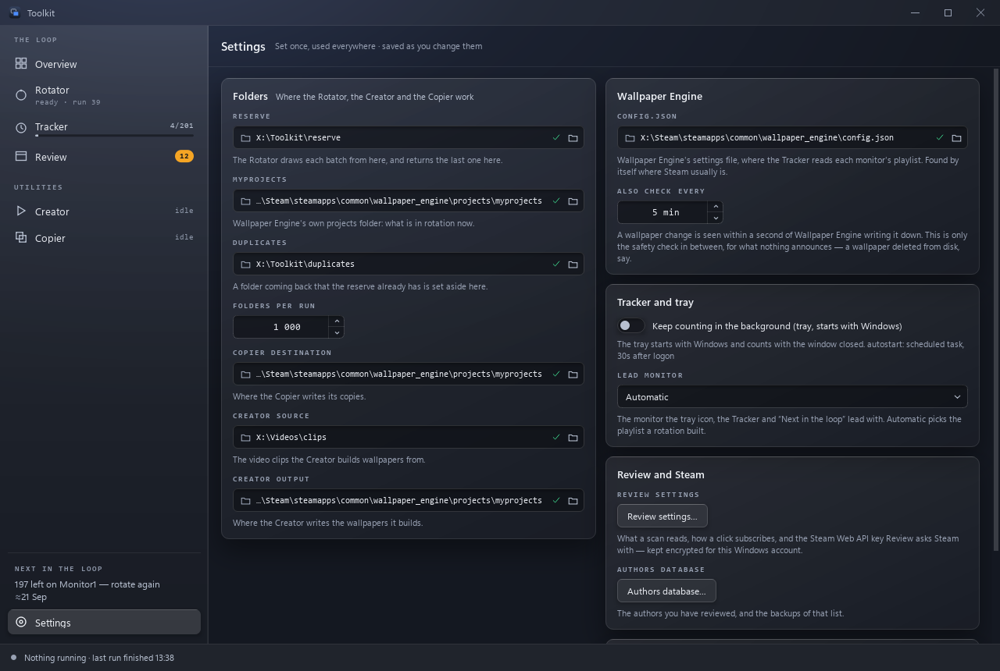

# Settings

**What is set once, in one place: the last entry in the sidebar, or Ctrl+7.**

Folders, Wallpaper Engine's settings file, counting in the background and the
Steam key used to be spread over the tools that use them. They are set here
now, and the pages show them small — a folder with a ✓ once it has been found,
and **Change in Settings** beside it.

Every change is saved as it is made. There is no Save button, and nothing to
undo: choosing a folder again puts the old one back.

## Folders

| Field | What it is | Stored in |
|---|---|---|
| Reserve | The [Rotator](rotator.md)'s library: each batch is drawn from here, and the last one returned here. | `data/config.json` (`source`) |
| myprojects | Wallpaper Engine's own projects folder: what is in rotation now. Detected from Steam. | `data/config.json` (`destination`) |
| Duplicates | Where a folder coming back that the reserve already has is set aside. | `data/config.json` (`duplicates`) |
| Folders per run | How many folders a rotation moves in. 1 000 unless changed. | `data/config.json` (`count`) |
| Copier destination | Where the [Copier](copier.md) writes its copies. Detected from Steam. | `data/suite.json` (`copier.dest`) |
| Creator source | The video clips the [Creator](creator.md) builds wallpapers from. | `data/suite.json` (`creator.source`) |
| Creator output | Where the Creator writes the wallpapers it builds. Detected from Steam. | `data/suite.json` (`creator.target`) |

Each folder is checked as soon as it is chosen — on a worker, because the
library may be on a hard disk that is asleep — and says **folder not found**
in red when it is not there. A folder can also be dropped onto its field from
Explorer.

**While the Rotator is at work its four fields are read-only**, and the panel
says so: the run is using those folders. They open again when it ends.

The Rotator keeps its own file, `data/config.json`, as it always has; the
Settings page writes to it through the Rotator's own code, and everything else
to `data/suite.json`. See [Configuration](configuration.md#folder-settings).

## Wallpaper Engine

- **config.json** — Wallpaper Engine's settings file, where the
  [Tracker](tracker.md) reads each monitor's playlist. Found by itself where
  Steam usually puts it; choose it here if Wallpaper Engine lives elsewhere.
  Choosing another one makes the Tracker start over on it.
- **Also check every** — a wallpaper change is seen within a second of
  Wallpaper Engine writing it down. This is only the safety check in between,
  for what nothing announces (a wallpaper deleted from disk). 5 minutes unless
  changed. See [the Tracker](tracker.md#when-it-looks).

## Tracker and tray

- **Keep counting in the background (tray, starts with Windows)** installs the
  tray tracker as a logon task, or removes it. Asking Windows which is set
  takes a moment, so the switch is greyed until the answer is in; the line
  under it then says how it is installed (`scheduled task, 30s after logon`,
  or `Run key`). See [Starting with Windows](tracker.md#starting-with-windows).
- **Lead monitor** — the monitor the tray icon, the Tracker and "Next in the
  loop" lead with. **Automatic** picks the playlist a rotation built. The tray
  reads the choice the next time it draws its icon; **Show on the tray
  icon** in a monitor's menu on the [Tracker](tracker.md#the-page) page writes
  the same setting.

## Review and Steam

- **Review settings…** opens the same dialog as the button in the Review page's
  header: what a scan reads, how a click subscribes, the Steam Web API key
  (kept encrypted for this Windows account — see
  [Secrets](configuration.md#secrets)) and the second folder for the authors
  database's backups. See [Review](review.md).
- **Authors database…** opens the authors you have reviewed and their
  backups — see [Authors database](authors-database.md).

## About

The name and version, and three buttons:

- **Open data folder** — `%LOCALAPPDATA%\WallpaperEngineToolkit` for a built
  exe, `data\` beside `run_app.py` from source
  ([Where things live](configuration.md#where-things-live)).
- **Open log folder** — `data\logs\`, a folder per tool.
- **Run selfcheck** — what `--selfcheck` does, from the window: it checks what
  this build can import and reach, writes `data/selfcheck.txt`, and says
  whether every check passed. **Open report** shows the file.
