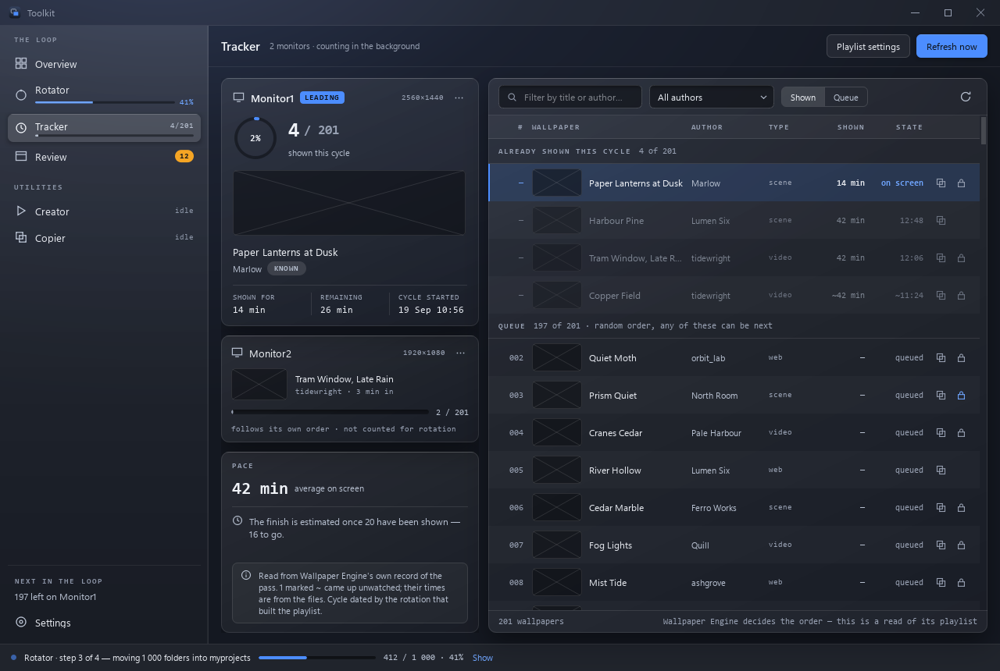

# Tracker

**How far Wallpaper Engine has got through the active playlist — `112/208`.**



## What it is for

After a [rotation](rotator.md) you build a playlist and Wallpaper Engine walks
it at one wallpaper per `delay` minutes. The only question that matters
afterwards is *how much of it has already been shown*, because that is when the
next rotation is due. Without an answer you either rotate early and throw away
wallpapers nobody saw, or rotate late and watch the same set for another week.

Wallpaper Engine does not report this. It stores neither a position nor a
shuffle, and its playlists are ordered `random`. The Tracker reconstructs it.

## When to reach for it

- Continuously, in the background, as a tray icon — that is its normal mode.
- Open the **Tracker** page when you want the detail: what is on screen and
  for how long, how long it has left, what has been shown and what has not,
  when the cycle started, and when the playlist should run out.

## How to use it

Open the Tracker page (Ctrl+3), or run the tray-only tracker:

```
python run_app.py --tracker
```

…or `run_tracker.cmd`. The tray icon is the app's mark, filling with colour as
the next wallpaper change nears; the tooltip says `2% · Monitor1 · 4 of 201
shown` per monitor, and a balloon
fires once a playlist has been shown end to end — that is the cue to rotate.
See [The tray](#the-tray).

Clicking the icon opens the main window on this page — as a **program of its
own**, at normal priority, and clicking again brings the same window forward
rather than opening another. The window used to be built inside the tray; when
it froze during a Review, ending it ended the count as well, and it ran at the
below-normal priority the logon task gives the tray. Now either can stop
without the other. The page in it looks for itself, on the same schedule as the
tray — a look is about 4 ms, taken only when Wallpaper Engine writes — and the
two write the same state file and merge on save, so running both is fine. A
named mutex keeps autostart and a manual `run_tracker.cmd` from becoming two
icons both looking, and another keeps the window to one.

**New cycle…** resets the count by hand, after asking; it is in each
monitor's **…** menu on the page and in **Playlist settings**. You should rarely
need it — see [cycles](#cycles).

## The page

- **The leading monitor**, in detail: the ring and `4 / 201` shown this cycle,
  a preview of the wallpaper on screen, its title and author — with a
  **Known** chip when the author is in your [authors
  database](authors-database.md) — and three facts:
  - **SHOWN FOR**, since it came up;
  - **REMAINING**, the [countdown](#the-countdown-ring): `≈` when it is
    estimated, "paused" in amber while Wallpaper Engine has paused that
    monitor, "— disconnected" in red while Wallpaper Engine is not running;
  - **CYCLE STARTED**, `~` when it was [worked out
    afterwards](#when-the-cycle-began) rather than seen.

  Its **…** menu: *Show its playlist below*, *Show on the tray icon* (see
  [which monitor leads](#which-monitor-leads)) and *New cycle…*. With Wallpaper
  Engine closed the card keeps the last known wallpaper and count and says so:
  "last known · Wallpaper Engine is not running".
- **The other monitors**, as summaries. One whose playlist no rotation built
  says "follows its own order · not counted for rotation".
- **Pace**: how long a wallpaper has been on screen on average this cycle —
  real time, from the cycle's start over what it has shown, so the nights and
  the paused hours are in it — and when the playlist runs out at that pace:
  "At this pace the playlist empties ≈21 Sep, about 09:10 — time to rotate
  (run 39)". The rotation is yours to start. The date comes once 20 have been
  shown; before that the page says how many to go. Under it, what the count
  rests on, never hidden: whether it follows [Wallpaper Engine's own
  record](#wallpaper-engines-own-record) or the file handle, how many times are
  reconstructed (`~`), how the cycle is dated; and in amber, a pass Wallpaper
  Engine [threw away](#when-wallpaper-engine-starts-a-playlist-over) and
  wallpapers deleted from disk.
- **The whole playlist shown**: the ring closes in green, the count turns
  green, the card gets a green edge and a note says "Whole playlist shown —
  time to rotate", with **Open Rotator**. The count in the sidebar turns green
  too.
- **The playlist**, as a table: *Already shown this cycle*, newest first, the
  one on screen at the top and selected; then the *Queue*. The columns:
  - **#**: the place in the queue of a sorted playlist. A random one has no
    queue (see [what comes next](#what-comes-next)), so its rows keep the
    playlist's own order and **#** is the place in the playlist. Clicking
    **#** undoes whatever sort another column's title put the table in, back
    to the order above; its title is lit while nothing else sorts.
  - **WALLPAPER**: a square 200 × 200 preview and the title. A GIF preview
    plays, for the rows on screen (eight at most, and none with Windows'
    animations off). A window too narrow to leave the title room draws the
    preview at 120 or 72 instead.
  - **TYPE**.
  - **SIZE**: the wallpaper's folder, measured after the titles are read
    (blank until then, and for a folder that is gone).
  - **SHOWN**: how long it stayed up — until the next one came up, in real
    time, like the pace.
  - **STATE**: on screen, the time it came up, or queued.
  - Three small buttons at the end of each row, quiet until the pointer is on
    the row, each saying what it does in its tool tip: **Send to Copier**,
    **Mark [protected]** and **Delete** (see [a row's
    actions](#a-rows-actions)).

  `~` marks a time rebuilt from file times or Wallpaper Engine's record.
  Filter by title, jump to *Shown* or *Queue*.
  Clicking a row opens Explorer on that wallpaper (see [watch out
  for](#watch-out-for)).
- **Refresh now** looks at Wallpaper Engine at once and reads the list again;
  the table's ↻ reads the titles, the authors and the sizes again.

### A row's actions

**Send to Copier** puts the wallpaper's folder on the [Copier](copier.md)'s list
for the usual number of copies (3), and you stay on the Tracker: a toast says
so, with **Show** to go to the Copier. A folder already on the list is not
listed twice; the toast says it is there already. The copying itself is
started on the Copier page, as ever.

**Mark [protected]** is for a folder that sits directly in the Rotator's
myprojects (the folder set on the [Settings](settings.md) page): it renames
`wallpaper_0012` to `[protected] wallpaper_0012`, and from then on the
[Rotator](rotator.md) leaves it in myprojects, run after run. It asks first,
showing the rename. Workshop (subscribed) folders are never offered it, and a
folder that is protected already shows a blue lock instead. There is no
"unprotect": rename the folder back in Explorer.

**Delete** sends the wallpaper's folder to the Recycle Bin, after asking. A
Workshop (subscribed) one — a folder under Steam's
`workshop\content\431960` — is unsubscribed first, through the running Steam
client, as Review subscribes: deleting its folder alone would only have Steam
download it again. If Steam is not running or will not drop the subscription,
nothing is deleted and a red toast says why. A folder in myprojects is your own
copy, whatever its `project.json` says, and unsubscribes nothing. The row
leaves the table at once; the playlist still lists the wallpaper until the next
rotation rebuilds it, and the count leaves it out from the next look. The work
runs off the window's thread, the button off meanwhile; while a rotation runs,
Delete only says to wait for it. The one on screen can usually not be moved
while Wallpaper Engine shows it: the question warns of it, and the toast says
so if Windows refuses.

**Wallpaper Engine's playlist is not touched** by Mark [protected]. Its entry for that wallpaper
keeps the old name, so it stops working until the next rotation rebuilds the
playlist. The question says so before you agree, the toast says so after, and
the row keeps saying it: the lock turns amber and the title gets a line under
it, *playlist entry broken until the next rotation · renamed [protected]*. The
row keeps following the playlist (which still lists the old name); Send to
Copier and a click on the row use the new folder.

The rename runs off the window's thread — the library is on a hard disk — and
the button is off meanwhile. If it cannot be done, a red toast says why in
plain words and nothing changes: Wallpaper Engine (or another program) has the
folder in use, a folder with the new name is already there, Windows denied
access, or the folder is no longer in myprojects. While a rotation runs, a
click only says to mark folders once the run has finished.

**Where the titles and authors come from.** A wallpaper's title and type are
in its own `project.json`. Its author is in no file Wallpaper Engine keeps, so
the page takes the answers [Review](review.md) has already had from Steam
(`data/steam_cache.sqlite`), however old, and never asks Steam itself: a
wallpaper Review has not looked up shows "—". Both are read off the window's
thread and kept until the window closes. The first read of a playlist costs a
second or two a couple of hundred wallpapers on a hard disk (14 s for 1 756
measured here); its rows show at once, named by their folders, and fill in.

**The countdown on the page.** While the page is on screen the window keeps a
countdown of its own. It starts from the tray's, which the tray saves every 15
seconds, and follows Wallpaper Engine's changes and pause rules from there,
the way the tray's estimate does. It never reads Wallpaper Engine's memory —
the tray does that — and never writes the tray's file. To Wallpaper Engine this
window is an application like any other: focused or maximized on a monitor, it
pauses that monitor's wallpaper, and the page says so.

**Playlist settings** (the header's button): where the count comes from —
Wallpaper Engine's `config.json`, how often it also checks, which monitor
leads, whether it counts in the background, all set on the
[Settings](settings.md) page, which it links to — then **Rebuild from file
times** (after asking; see [time nobody was
watching](#time-nobody-was-watching)) and **New cycle…** for each monitor.

The header's line says whether the count goes on with the window closed:
"counting in the background" while the tray tracker runs, "counting while this
window is open" when it does not.

With nothing to show, the page says why: `config.json` was not found (choose it
in Settings), no monitor plays a playlist, or Wallpaper Engine is not running.

## The tray

The tray icon is the one part of the toolkit that lives outside its window.

**The icon** is the app's mark (the two frames of the Branding page, without
the tile), and its frames fill with colour **from left to right** as the next
wallpaper change nears: empty just after a change, full the moment the next one
is due. The scale runs from the left edge of the back frame to the right edge
of the front one, so both frames filled whole is 100 % and anything less is
less. The playlist's progress is not in the icon: the tooltip and the window
say it. Four states, and it never animates:

| State | Looks like | When |
|---|---|---|
| running | the fill in the accent, `#4C8DFF` | Wallpaper Engine's timer is being followed |
| paused | the fill stops and goes cold grey, `#7C879C`, with a pause badge | the wallpaper is paused |
| unknown | no fill, the mark muted, an amber **?** badge (`#E8A33D`) | no timer reading yet, Wallpaper Engine is not running, or there is no playlist |
| finished | both frames green, `#3DD68C`, with a tick badge | every wallpaper of the playlist has been shown |

The badge in the bottom right corner is only for the three states that are not
the usual one. The frames stay dark in any Windows theme, so the colours are
the same on a light taskbar as on a dark one.

The icon is drawn **for each size Windows asks for** — 16, 20, 24, 32, 40 and
48 px, so 100 % to 300 % scaling — rather than one picture shrunk, and the edge
of the fill sits on a whole pixel: at 16 px the mark is about ten pixels wide,
so the fill moves in about ten steps there. The icon is redrawn only when the
fill crosses a step of the largest size (31 of them), so on a 10-minute delay
about every twenty seconds, never every second.

**The tooltip** has one line per monitor, the lead one marked `▸`, each starting
with the share of its playlist shown: `▸ 55% · Monitor1 · 81 of 192 shown ·
next in 4:29`, `… (paused)` while paused, and `100% · Monitor1 · 192 of 192
shown · finished` once it is done.

**The menu** (right-click) opens with the icon in words — `tracking · 4 of 201
shown`, `paused · …`, `timer unknown · …`, `finished · all 201 shown` — then:

- **Open Toolkit** (Enter) — the window, on this page. A left click does the same.
- **Rotate now…** `run 39` — the window on the [Rotator](rotator.md), which
  checks the folders and asks "Start run 39?". Nothing is moved before that
  question is answered, so a stray click on the tray only opens a question.
- **Review** `12 waiting` — the window on [Review](review.md). The number is the
  authors of the last scan not gone through yet, and is left out when there is
  none.
- **Settings** — the window's [Settings](settings.md).
- **Quit** — stops the tray. The count survives a restart.

*Refresh now*, *Show on the icon*, *New cycle* and *Start with Windows* are not
in the menu: they are on this page (the header's Refresh, a monitor's **…**
menu, **Playlist settings**) and on the Settings page.

**The tooltip** has a line per monitor: `▸ Monitor1 · 4 of 201 shown · next in
2:45`, the lead marked; Windows cuts a tooltip at 128 characters, so lines that
do not fit are left out whole.

**Who they come from.** Windows names a notification's sender from the
process's AppUserModelID and the Start-menu shortcut that carries it. The built
exe makes sure `Toolkit.lnk` is in your Start menu (pointing at itself, with
the app's icon and ID), and only then takes that ID, so the balloons say they
come from **Toolkit**; `data/tracker.log` says which it did at each start. A
source run does neither and keeps Python's name. Deleting the shortcut is
harmless: the next start makes it again.

**The balloons** are the only two the toolkit sends:

- *Playlist finished* — "All 201 wallpapers on Monitor1 have been shown. Rotate
  to swap in 1 000 folders from the reserve." The second sentence is left out
  when the Rotator's settings do not say how many folders a run moves in. When
  the window has counted the reserve within the last day, with no rotation
  since and for the same batch size, it says how many have never been used:
  "Rotate to swap in 1 000 of the 4 210 folders that have never been used", or,
  with fewer left than a run moves, that the run draws from the whole reserve
  again. The tray does not list the reserve itself (it is on the wallpaper
  disk): the window leaves its count in `data/reserve_count.json`.
- *Playlist started over* — "Monitor1 is back at wallpaper 1 of 201 without a
  rotation — Wallpaper Engine restarted or the playlist was rebuilt. The count
  starts again."

Each is shown once per cycle. Clicking one opens the window on the Rotator
(after *finished*) or on this page (after *started over*). They are Windows'
own notifications from the tray icon, so they have no buttons.

The tray is kept light on purpose: it runs all day at below-normal priority. It
imports none of the window's code, draws its menu without the stylesheet, and
reads two small files in the data folder only when the menu opens.

## Starting with Windows

**Keep counting in the background** on the [Settings](settings.md#tracker-and-tray)
page, or without a window:

```
python run_app.py --autostart on
python run_app.py --autostart off
python run_app.py --autostart status
```

It installs a **scheduled task** triggered at logon with a 30-second delay, and
falls back to the `HKCU\...\CurrentVersion\Run` key if Task Scheduler refuses.
Only one of the two is ever installed, and the Settings page shows which.

The task is preferred because a Run entry is launched by Explorer during shell
startup, when the notification area may not exist yet and a tray icon has
nowhere to go. A delayed task starts once the desktop has settled and does not
depend on Explorer processing the Run key at all.

It is defined from XML rather than through `schtasks /tr`, which cannot be
handed a quoted path plus arguments unambiguously. That also makes room for the
settings a long-lived process needs — chiefly no execution time limit, since the
default stops a running task after three days.

> **Upgrading from "Wallpaper Suite".** The app used to register its task under
> the old name. On first run the entry is renamed in place, carrying its action,
> trigger and delay over unchanged, and the old one is removed. If the entry
> pointed at an executable that no longer exists — because the build was
> replaced by one under the new name — it is rebuilt from scratch instead. This
> happens once; the result is recorded in `data/suite.json`.

The tracker does not treat a missing notification area as fatal: it waits up to
two minutes for one, and if none appears it keeps counting without an icon
rather than quitting or putting a modal dialog on screen at logon. Every launch
appends to `data/tracker.log` — start, whether the tray was there, and any
crash. A windowed build has no console, so that file is what answers "why was
there no icon after I logged in?".

## How it works

### Where the numbers come from

Playlists, their item lists and the timer delay are read from Wallpaper Engine's
own `config.json`, one active playlist per monitor, under
`<user>.general.wallpaperconfig.selectedwallpapers`.

That file is **not** a live source for what is on screen. Wallpaper Engine
flushes it when it starts and when it exits, so the current-wallpaper field
stays frozen at whatever was showing at launch.

What *is* live is `bin/playliststate.bin`, rewritten at every wallpaper change
(see [the countdown ring](#the-countdown-ring)). Per monitor it names the
wallpaper on screen and every entry the current pass has **not drawn yet**. For
a random playlist that is the count itself: what the pass has drawn has been
shown, what is waiting has not.

### When it looks

The tracker looks whenever Wallpaper Engine rewrites `playliststate.bin` or
`config.json` — both are checked with a `stat` once a second, about 20 µs — so
a change reaches the count within a second or so of the engine writing it down,
together with the ring. Every change is seen, including wallpapers skipped in a
hurry.

It used to look every 30 seconds whether anything had happened or not. On a
10-minute playlist nineteen looks in twenty found nothing, and each still cost
about 50 ms on the tray's GUI thread plus a rewrite of the 200 KB
`data/tracker.json` — some 2900 looks and 570 MB of rewrites a day, for about
290 changes on two monitors. A look now costs about 4 ms, and the file is
written only when something in it changed.

Every look is taken on a thread of its own, in the tray and in the window
alike. A look reads `config.json` and the files of the playlist's wallpapers,
and on a library kept on a hard disk that has spun down, the first file it
touches waits for the disk: the tray's hang log once caught 54 seconds inside
the probe, with the tray icon and the window frozen all that time. Now the
count simply arrives when the disk does, and nothing else waits for it. A new
cycle and rebuilding from file times run on the same thread, after any look
already under way.

A slower **safety check** stays, every five minutes by default ("Also check
every" on the [Settings](settings.md#wallpaper-engine) page), for what no write announces — chiefly a wallpaper deleted
from disk. Where there is no readable `playliststate.bin` at all, the tracker
goes back to looking every 30 seconds, because then nothing else will tell it;
`data/tracker.log` says which of the two it is doing.

### Wallpaper Engine's own record

Where the state file describes the playlist — random order, the wallpaper on
screen in the playlist and no longer waiting, a deck of this playlist rather
than another — the count follows it. Credits it contradicts are withdrawn. A
change looked at as it is written is dated to the second from the write;
anything drawn between two looks, or while nothing was running, is counted too
and marked `~`, dated from its file's access time. The page's Pace notes say
"Read from Wallpaper Engine's own record of the pass".

Checked against the live tracker before the switch, the deck named the same
wallpaper on screen as the handle probe on both monitors, and disagreed with the
count only where access times had credited something the engine had not drawn:
181 counted on a playlist it had drawn 180 of, 6 on one it had drawn 4 of. Each
such credit made "playlist finished" arrive a wallpaper early.

### Where the record does not reach

A **sorted** playlist, whose deck has not been checked against a real one, and a
state file that does not fit the playlist, are counted the way everything was
before the state file was understood — by the **file handle**. The renderer
keeps the wallpaper it is showing open, so opening a path with no sharing flags
gets `ERROR_SHARING_VIOLATION` for exactly that one file and succeeds for every
other — for `.mp4` and `scene.pkg` alike. The whole playlist is swept every
look, about 17 ms for 1300 items.

The sweep deliberately does **not** stop at the item found last time. Wallpaper
Engine does not always release a wallpaper it has moved on from; two files were
caught held at once, one playing and one abandoned half an hour earlier. When
several are held, the one whose file was **read most recently** is the one on
screen.

### What neither can see

- **Deleted wallpapers.** Wallpaper Engine goes on listing a wallpaper after its
  folder is gone — in its deck too — and it can never come up again. These are
  found by checking existence every five minutes and whenever `config.json` or
  the cycle changes (about 12 ms for 1600 items), and held out of the total. On
  the playlist that prompted this: 197 of 208 shown, all 11 stragglers deleted
  mid-cycle — the tracker would have read 197/208 for ever. A file missing from
  a folder that has *itself* vanished is left alone instead: that is an
  unmounted drive, not a deletion.
- **Web wallpapers**, to the handle probe. An `.html` wallpaper is read once by
  a browser process and never held. The engine's record counts them like any
  other; where the probe is in use, its access time is the only thing that
  credits one — see reconciliation below.

### Cycles

Everything shown since a playlist was first seen is one *cycle*, kept in
`data/tracker.json` as `item -> first shown`.

A rotation replaces the playlist wholesale, so when the item list overlaps the
tracked one by less than half it is treated as a new playlist: the old cycle is
archived and the count restarts by itself. Smaller edits — a handful of items
added or removed — keep the cycle and adjust the total.

A rotation that [rebuilds the playlist](rotator.md#wallpaper-engines-playlist)
also starts the monitor's pass over, so the new cycle begins the moment
Wallpaper Engine comes back and deals the first wallpaper of the new set.

### Time nobody was watching

A pass followed through Wallpaper Engine's record needs none of this section:
the deck says what was drawn while nothing ran. What follows is for the
playlists counted by the handle probe.

A tally that only advances while the app happens to be running drifts behind
silently. NTFS fills the gap: with last-access updates on (the Windows default,
`fsutil behavior query disablelastaccess`), showing a wallpaper stamps its
file's access time, at one-hour granularity — far finer than the delay between
wallpapers.

So the tracker is a **reconciler**, not a counter. It re-reads those stamps when
it adopts a playlist it has not been watching, when a look finds more than five
minutes passed since the last, and in any case every ten minutes. Recovered
entries are marked `~` and counted separately, so observation and reconstruction
are never confused. Where last-access updates are off, Playlist settings says
so, and the tracker counts only what it sees.

An access time is not proof of a display, though. Plenty of things read the
whole library at once — Wallpaper Engine refreshing its browser, a rotation
moving 200 folders, a backup walking the tree. On one real rotation 178 files
shared a single access time, and a playlist that had shown exactly one wallpaper
reported 180 of 199 done.

**The thing that separates them is the rate, and only the rate.** A machine
reads at 160 files a second; a person pressing "next" twice does it 22 seconds
apart; the playlist moves once per `delay`. So access times are grouped by the
quiet between them — five seconds of nothing ends a group — and a group is
discarded only when it holds at least five files *and* they arrived faster than
two a second. Everything else counts.

An earlier attempt tested against the playlist's cadence instead, reasoning that
displays cannot arrive faster than one per `delay`. That is false the moment
anyone skips by hand, and it cost what you would expect: two wallpapers skipped
22 seconds apart were discarded as a scan and sat in "not yet shown" for ever.
There is also deliberately no cap on how much one sweep may credit —
reconstructing a cycle that has run for days *should* credit most of it at once,
which is the very case such a cap refuses.

### When the cycle began

For a playlist the [Rotator](rotator.md) built, this is exact: `history.json`
records the folders each run moved, so the newest run sharing at least half its
folders with the playlist *is* its starting moment. Otherwise the start is taken
from the break in the access times — inside a running cycle wallpapers are shown
day after day, so only a gap of several days reads as "the previous playlist
ended here". If neither is conclusive the tracker refuses to guess and starts
counting from now. The page's Pace notes always say which of the three applied.

### What comes next

Wallpaper Engine offers two orders, `random` and `sorted`, and only sorted has a
queue: it walks the items in order and wraps, so the list reads from just after
the wallpaper on screen and its top row is genuinely next.

Random has no queue anywhere a program can read. `config.json` stores the order
setting and nothing else; the log says nothing; and the order observed here has
no relation to the list — 36 displays watched live, not one step to the next
position, a rank correlation of +0.07. Each pass is a shuffle rather than a dice
roll (196 changes on a 189-wallpaper playlist repeated one wallpaper, where
drawing with replacement repeats about seventy), so every wallpaper still
waiting is exactly as likely to be next as any other.

The queue's header therefore says which of the two it is showing — "up next, in
playing order" or "random order, any of these can be next" — rather than
inventing an order. To get a real queue, set the playlist to Sorted in
Wallpaper Engine.

### Which monitor leads

With two monitors running two playlists, the page's detailed card, its table,
the tray number and "Next in the loop" all follow the playlist a **rotation
built** — that is the one whose end is the cue to rotate again. A subscribed or
hand-made playlist runs forever and says nothing about timing. *Show on the
tray icon* in a card's menu and **Lead monitor** on the Settings page override
this, and the choice is remembered.
(*Show its playlist below* only changes which list the table shows.)

### When Wallpaper Engine starts a playlist over

Wallpaper Engine can begin a playlist again on its own, and then the count
describes a pass that no longer exists. It happened for real: the machine was
started with one monitor, Wallpaper Engine launched, and the second monitor
plugged in afterwards. That monitor's pass was thrown away and a fresh one
begun, while the tracker went on at 81/195 — counting as shown the very
wallpapers about to be shown again.

`bin/playliststate.bin` says so plainly: it keeps, per monitor, the entries the
current pass has not drawn yet. Everything counted as shown should be missing
from that list, and before the restart it was. After it, 77 of 83 were waiting
again; on the other monitor, 196 of 200.

So on every look, when at least half of what the cycle counts as shown (and no
fewer than three) is back in the engine's deck, the cycle is archived with the
reason and a new one begins from what the engine has drawn — credited from the
engine's record and marked `~`. A deck that does not fit the playlist is
ignored. The tray says when it happens ("Playlist started over") and the
page's Pace notes say, in amber, what the old count had reached.

A pass that ran to its **end** begins again the same way, and is told apart by
what was left: nothing, or only the wallpaper now on screen. That covers both
things Wallpaper Engine might do at the end — write out an empty deck first, or
shuffle the next pass as it draws the last wallpaper, in which case the finished
cycle is never seen whole. Either way the tray says "Playlist finished" once,
and the page's Pace notes say the next pass began after all of the last one
was shown.

**New cycle…** on a followed pass sets aside what the pass has drawn so far,
since the engine's record would otherwise restore the whole count at the next
look. The set-aside wallpapers count again once Wallpaper Engine deals them
again.

**What causes it, and how to avoid it.** Wallpaper Engine keeps a pass with the
playlist *as applied to a monitor*, and discards it whenever the playlist is
applied to that monitor again:

- **A monitor that appears after Wallpaper Engine has started.** Started with
  one screen and given the second two minutes later, the second screen's pass
  was replaced (deck 118 to 199) while the screen that had been there carried on
  untouched (deck 1385 to 1383). So connect and switch on every monitor *before*
  starting Wallpaper Engine.
- **Saving the playlist.** A subscribed playlist extended from 1 361 to 1 386
  wallpapers began a fresh pass seven seconds later. Add subscriptions in
  batches, when the pass is done anyway.

Skipping ahead does *not*: a burst of changes took the deck from 195 to 192 one
draw at a time, in the same pass.

### The countdown ring

The number in the middle of the tray icon is how much of the playlist has been
shown. The ring around it is how long the current wallpaper has left — full just
after a change, draining clockwise from twelve, grey while paused, a dotted empty
track while the time is not yet known ([the tray](#the-tray) has the four
states).

Wallpaper Engine does not publish its timer. Its `-control` commands report no
time and it keeps no pipe open to ask. It does keep two files in `bin/` in a
small length-prefixed format of its own (magic `PLPV0005`), both decoded here
exactly:

- `playliststate.bin` — per monitor, the wallpaper on screen and the entries
  this pass has not reached. **Rewritten at every change, to the second.** Its
  modification time is the one exact clock available.
- `playliststatetime.bin` — the seconds each timer had run, but written only as
  Wallpaper Engine exits, so it cannot follow a running timer and is unused.

**The timer is the playlist's `delay` of *playing* time**, measured rather than
assumed: changes on a 10-minute playlist at 14:53:46, 15:03:46, 15:13:45,
15:23:45. Unless "update on pause" is on, it stops while the wallpaper is
paused — and pausing is **per monitor**, decided by Wallpaper Engine's own
`playbackfocus` / `playbackmaximized` / `playbackfullscreen`: an application
focused, maximized or covering *that* monitor pauses that monitor and no other.
Cross-checked by reading the position of each video file Wallpaper Engine had
open: the file behind the monitor judged paused stood still, the other advanced
about 12 MB a second.

Window overlays that sit over a screen without being an application — game and
capture overlays, tool windows, anything that never takes focus — are not
counted, and neither are Wallpaper Engine's own windows. This app's window *is*,
because to Wallpaper Engine it is an application like any other. Displays are
matched to `Monitor0` / `Monitor1` through the device paths Wallpaper Engine
records in `monitormap`. A tick costs 0.3 ms.

**Reading the timer itself.** The estimate above was off by up to seven seconds,
so wherever it can the tray reads the real value. Scanning `wallpaper64.exe` for
float32 values that grow in step with real time turns up one per monitor, each
dropping to 0.000 the instant its monitor changes. Each lives in a playlist
object that describes itself: the monitor's name as a short `std::string`, then
at fixed offsets the delay in minutes (+88), the playlist instance number
(+104), the timer in seconds (+108) and the transition in milliseconds (+116).
Nothing else in memory matches all five, so the object is found by searching for
the name and checking the rest against `config.json` and the state file. Access
is read-only (`PROCESS_QUERY_INFORMATION | PROCESS_VM_READ`); nothing is ever
written.

**Reading a process without stopping it.** The first version searched 1.4 GB in
16 MB pieces and made Wallpaper Engine stutter while it started. What the other
process feels is the length of one read, not their number:

```
piece      64 KB    256 KB      1 MB      4 MB     16 MB
median   0.33 ms   1.32 ms   5.26 ms   55.3 ms    ~220 ms
max      3.42 ms  12.45 ms  48.16 ms  154.6 ms
```

So the search reads 64 KB at a time, rests after each piece for as long as the
read took, runs at background thread priority, and does not start until
Wallpaper Engine has been up for 30 seconds. It starts with the smallest
regions, where a heap keeps small objects, and once one monitor's object is
found it looks beside it for the others — 24 MB instead of 861 MB. Where each
was found is written down, so the next tray to start checks two addresses
instead of searching at all.

```
cold, nothing remembered      25 MB     0.3 s   longest hold 0.60 ms
the place remembered           2 reads  0.0 s   longest hold 0.04 ms
the place has moved          141 MB     2.1 s   longest hold 0.80 ms
nothing matches at all      1374 MB    38.6 s   longest hold 3.96 ms
```

The last line is what a Wallpaper Engine update that moved the fields would
cost, after which the tray waits five times longer before each attempt, up to
half an hour.

Measured on two real changes, the countdown read 0.00 s and 0.97 s a quarter of
a second before the timer reset. The remaining second is Wallpaper Engine's own:
it checks the timer about once a second, so it changes at anywhere from 599 to
601 s. If the object cannot be found — a 32-bit build, or an update that moved
the fields — the tray says so in `data/tracker.log` and uses the estimate.

What cannot be known is said, not guessed. Until the tray has seen a change the
ring is empty, because the state file does not say when the wallpaper on screen
came up. The first change after Wallpaper Engine starts is marked approximate
("≈") as a precaution. The count is saved to `data/wallpaper_timer.json` every
15 seconds and picked up again by a restarted tray, as long as Wallpaper Engine
and the wallpaper are the same.

### The estimate

With the order set to `random` the same wallpaper can come up twice, so `seen`
and `changes` are counted separately. Time left is `remaining x delay`,
stretched by what a newly seen wallpaper has actually cost so far.

It deliberately does not model the order. An earlier version switched to the
coupon-collector expectation as soon as a single repeat appeared, turning a
2h40m estimate into 4d21h on one stray event. The evidence was against it
anyway: 192 distinct wallpapers out of 193 displays is a shuffled playthrough,
where drawing with replacement from 208 would yield about 125. Repeats are also
only visible in the displays actually watched, never in the ones rebuilt from
file times, so they are far too weak a signal to pivot a model on.

On a pass followed through Wallpaper Engine's record there is no stretching at
all: nothing is drawn twice within a pass, so what is left is exactly
`remaining x delay`. A repeat rate carried over from the probe's count — 22
"repeats" on a 189-wallpaper playlist here, most of them the probe losing track
— has nothing to say about it.

Wallpaper time is not wall-clock time — it only passes while Wallpaper Engine is
running and unpaused, and `playbackfullscreen` / `playbackmaximized` stop the
timer behind a game. So the Pace panel projects the finish from the pace the
cycle has actually kept — elapsed time divided by wallpapers seen — which is
the number that answers "when can I rotate?".

## Files

| File | What it holds |
|---|---|
| `data/tracker.json` | the live cycle per monitor, plus the last 40 finished cycles |
| `data/wallpaper_timer.json` | the countdown, saved every 15 seconds |
| `data/tracker.log` | every launch, whether the tray appeared, any crash |
| `data/suite.json` under `tracker` | safety-check interval (`heartbeat`, seconds), `config.json` path, which monitor the icon shows |

It **reads** the Rotator's `history.json` to date a cycle and never writes to
it. The tracker writes nothing back to Wallpaper Engine; only a rotation does
(see [the Rotator](rotator.md#wallpaper-engines-playlist)). The one thing the
page changes on disk is a folder's name in myprojects, when you **Mark
[protected]** and agree.

## Watch out for

- **Clicking a row** opens Explorer on that wallpaper's folder with the file
  selected. A playlist outlives its files, so a row whose file is gone opens the
  nearest folder that still exists instead.
- **After Mark [protected]** the playlist's entry for that wallpaper is broken
  until the next rotation rebuilds the playlist: Wallpaper Engine looks for
  the old folder name. The page remembers the rename until the window closes;
  opened again before a rotation, the row shows the old name, and marking it
  again finds the folder already renamed, and the row catches up.
- The **AUTHOR** column is only as complete as Review's Steam cache: the
  wallpapers of a rotated-in batch mostly came from the reserve, which Review
  has not looked up, and show "—".
- Playlists that change on a schedule or when a video ends have no delay to
  count, and show no ring.
- Per-application rules (`apprules`) and the on-battery setting are not
  modelled. Settings changed in Wallpaper Engine reach the tracker when it next
  writes `config.json`, which it does on start and exit.
